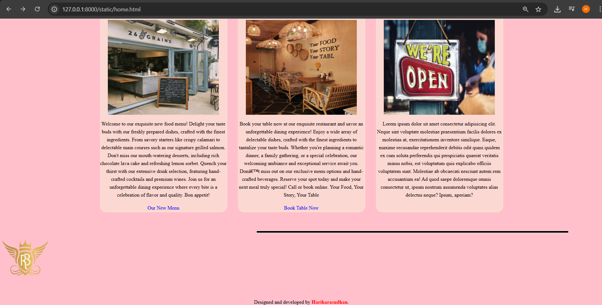
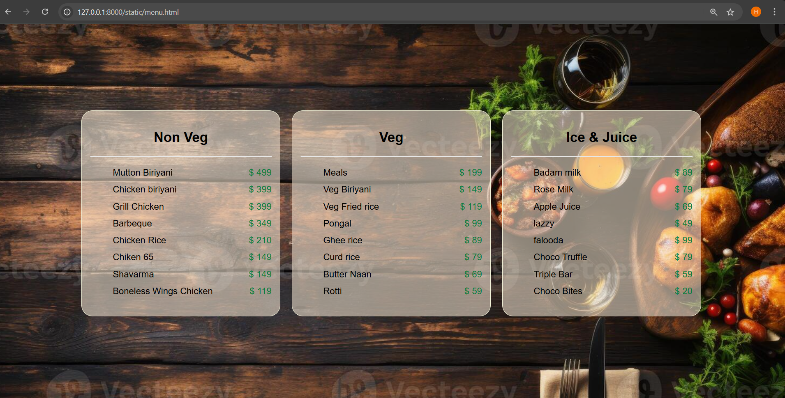
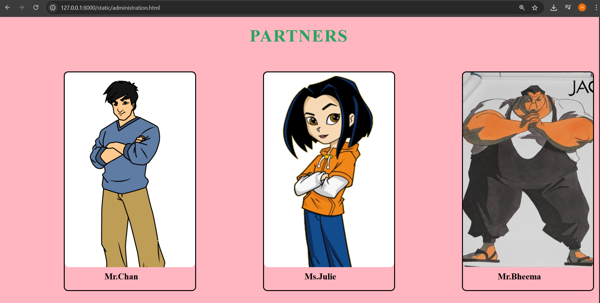
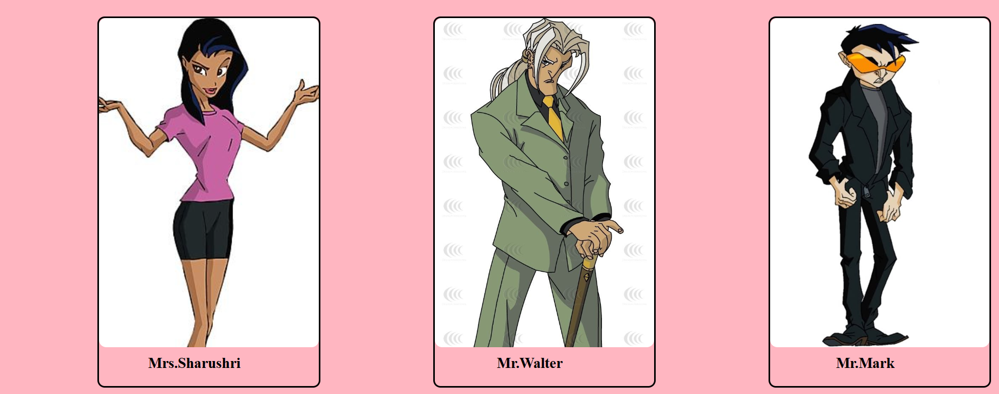
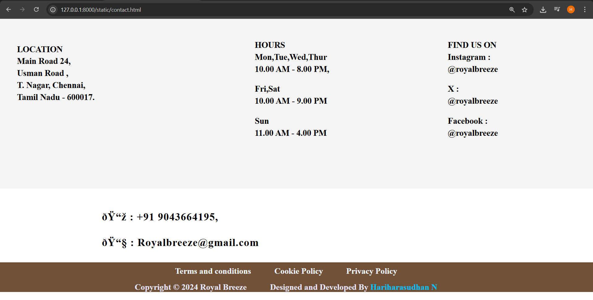

# Ex.07 Restaurant Website
## Date:19.05.2025

## AIM:
To develop a static Restaurant website to display the food items and services provided by them.

## DESIGN STEPS:

### Step 1:
Requirement collection.

### Step 2:
Creating the layout using HTML and CSS.

### Step 3:
Updating the sample content.

### Step 4:
Choose the appropriate style and color scheme.

### Step 5:
Validate the layout in various browsers.

### Step 6:
Validate the HTML code.

### Step 7:
Publish the website in the given URL.

## PROGRAM:
```
home.html
<html>
  <head>
    <title>Restaurnt Poster</title>
    <body bgcolor="pink">
      <center>
      <div class="con">
        
        
        <h1>Royal Breeze</h1>
    

    </center>
      <style>
        h1{
          color: brown;
          font-size: 50px;
          font-family:cursive;
          
        }
        .con{
          display: flex;
          align-items: center;
          margin-left: 450px;
        }
        nav{
          background-color: black;
          color: beige;
          padding: 15px;
          border-radius: 20px;
        }
        
        .cd{
          width: 1500px;
          
        }
        li,ul{
          display: inline;
          font-size:xx-large; 
        }
        ul{
          margin-right: 100px;
        }
        li{
          margin: 90px;
          cursor: pointer;
        }
        li:hover{
          color:skyblue;
        }
        .box{
          background-color:rgba(250, 235, 215, 0.553);
          display:inline-block;
          border-color:beige;
          border-radius: 20px;
          border-width: 1px;
          border-style: solid;
          width: 400px;
          border-left: 500px;
          margin: 15px;
          line-height: 25px;
          
        }
        .container{
          text-align: center;
        }
        hr{
          height: 5px;
          background-color:black;
          margin-left: 800px;
          margin-right: 100px;
          border-style:groove;
          border-radius: 5px;
        }
        .content{
          
          background-size: 1400px; 
          background-position: center;  
          padding: 20px;  
          border: 10px;
          
          position: relative;
          
        }
        .content img{
            border-radius: 80px;
            width: 1400px;
            height: 300px
        }
        .text{
            color: white;
            position: absolute;
            top: 50%;
            left: 50%;
            transform: translate(-50%, -50%);
            font-size: 24px;
            font-weight: bold;
            
        }
        .content h1{
            color:white;
            
        }
        h3{
          color: red;
        }
        .highlight {
          color: red;
          font-weight: bold;
      }
      a:hover{
        text-decoration: none;
      }
      a{
        text-decoration: none;
      }
        </style>
        <center>
      <div class="cd">
        <nav>
         <ul>
          <a href="home.html" style="color:white"><li>home  |</li></a>
          <a href="menu.html" style="color: white;"><li>menu  |</li></a>
          <a href="administration.html" style="color:white"><li>administartion  |</li></a>
          <a href="contact.html" style="color: white;"><li>contact us    </li></a>
         </ul>
       </nav>
      </div>
    </center>
    <br>
    <br>
    <br>
    <center>
  <div class="content">
    
    <div class="text ">
        <h1>30% off this week</h1>
        <p>Join us for our grand opening! Experience mouth-watering cuisine, a cozy atmosphere, and exceptional service. Reserve your table now for an unforgettable dining experience. Call or book online. We can't wait to welcome you!</p>
    </div>
</div>
  </center>
  <br>
  <br>
  <div class="container">
          <div class="box">
            <h2>Our New Menu</h2>
            
            <p>Welcome to our exquisite new food menu! Delight your taste buds with our freshly prepared dishes, crafted with the finest ingredients. From savory starters like crispy calamari to delectable main courses such as our signature grilled salmon. Don't miss our mouth-watering desserts, including rich chocolate lava cake and refreshing lemon sorbet. Quench your thirst with our extensive drink selection, featuring hand-crafted cocktails and premium wines. Join us for an unforgettable dining experience where every bite is a celebration of flavor and quality. Bon appetit!</p>
            <a href="new menu.html">Our New Menu</a>
          </div>
          <div class="box">
            <h2>Book A Table</h2>
            
            <p>Book your table now at our exquisite restaurant and savor an unforgettable dining experience! Enjoy a wide array of delectable dishes, crafted with the finest ingredients to tantalize your taste buds. Whether you're planning a romantic dinner, a family gathering, or a special celebration, our welcoming ambiance and exceptional service await you. Don’t miss out on our exclusive menu options and hand-crafted beverages. Reserve your spot today and make your next meal truly special! Call or book online. Your Food, Your Story, Your Table</p>
            <a href="book table.html">Book Table Now</a>
          </div>
          <div class="box">
            <h2>Opening Hours</h2>
            
            <p>Lorem ipsum dolor sit amet consectetur adipisicing elit. Neque sint voluptate molestiae praesentium facilis dolores ex molestias at, exercitationem inventore similique. Eaque, maxime recusandae reprehenderit debitis odit quasi quidem ex cum soluta perferendis qui perspiciatis quaerat veritatis minus nobis, est voluptatum quis explicabo officiis voluptatem sunt. Molestiae ab obcaecati nesciunt autem rem accusantium ea! Ad quod saepe doloremque omnis consectetur ut, ipsum nostrum assumenda voluptates alias delectus neque? Ipsum, aperiam?</p>
            <br>
          </div>
  </div>
  <br>
  <br>
  <div class="exit">
    <hr>
    
</div>
<br>
<br>
<center>
  <p>Designed and developed by<span class="highlight"> Hariharasudhan</span>.</p>
</center>
    </body>
   
  </head>
</html>

menu.html
<html>
<head>
    <title>Food Menu</title>
    
    <style>
        body {
            background-image: url('back.jpg');
            background-size: cover; 
            background-attachment: fixed; 
            margin: 0;
            padding: 0;
            display: flex;
            justify-content: center;
            align-items: center;
            height: 100vh;
            font-family: Arial, sans-serif;
        }
        .box1 {
            display: flex;
            justify-content: space-around;
            width: 80%;
        }
        .box {
            background-color: rgba(250, 235, 215, 0.553);
            border-color: beige;
            border-radius: 20px;
            border-width: 1px;
            border-style: solid;
            width: 30%;
            padding: 15px;
            line-height: 25px;
            text-align: center;
            margin: 10px;
        }
        .box{
            text-align: left;
        }
        
        .head{
            display: flex;
            align-items: center;
        }
        .rate li{
            display: flex;
            justify-content: space-between;
            margin: 5px 0;
        }
        .con{
            display: flex;
            align-items: center;
            margin-left: 450px;
          }
          h1{
            margin-bottom: 20px;
          }
          .ke{
            color: #097d3d;
          }
        
    </style>
</head>
<body>
    <div class="box1">
        <div class="box">
            <center><h2>Non Veg</h2></center>
            <hr>
            <ul>
                <div class="rate">
                <li>Mutton Biriyani<span class="ke">$ 499</span></li> 
                <li>Chicken biriyani<span class="ke">$ 399</span></li>  
                <li>Grill Chicken<span class="ke">$ 399</span></li>    
                <li>Barbeque<span class="ke">$ 349</span></li>
                <li>Chicken Rice<span class="ke">$ 210</span></li>
                <li>Chiken 65<span class="ke">$ 149</span></li>
                <li>Shavarma<span class="ke">$ 149</span></li>
                <li>Boneless Wings Chicken<span class="ke">$ 119</span></li>
                </div>
            </ul>
        </div>
        <div class="box">
            <center><h2>Veg</h2></center>
            <hr>
            <ul>
                <div class="rate">
                <li>Meals<span class="ke">$ 199</span></li>
                <li>Veg Biriyani<span class="ke">$ 149</span></li>
                <li>Veg Fried rice<span class="ke">$ 119</span></li>
                <li>Pongal<span class="ke">$ 99</span></li>
                <li>Ghee rice<span class="ke">$ 89</span></li>
                <li>Curd rice<span class="ke">$ 79</span></li>
                <li>Butter Naan<span class="ke">$ 69</span></li>
                <li>Rotti<span class="ke">$ 59</span></li>
            </div>
            </ul>
        </div>
        <div class="box">
            <center><h2>Ice & Juice</h2></center>
            <hr>
            <ul>
                <div class="rate">
                    <li>Badam milk<span class="ke">$ 89</span></li>
                <li>Rose Milk<span class="ke">$ 79</span></li>
                <li>Apple Juice<span class="ke">$ 69</span></li>
                <li>lazzy<span class="ke">$ 49</span></li>
                <li>falooda<span class="ke">$ 99</span></li>
                <li>Choco Truffle<span class="ke">$ 79</span></li>
                <li>Triple Bar<span class="ke">$ 59</span></li>
                <li>Choco Bites<span class="ke">$ 20</span></li>
            </div>
            </ul>
        </div>
    </div>
</body>
</html>

administration.html
<!DOCTYPE html>
<html lang="en">

<head>
   <style>
        * {
            margin: 0;
            padding: 0;
            box-sizing: border-box;
        }
        body{
            background-color: lightpink;
        }
        .header {
            background-color:beige;
            padding: 5px 0;
            text-align: center;
            margin-top: -10px;
            display: block;
        }
        
        .logo {
            display: flex;
            justify-content: center;
            align-items: center;
        }
        
        .img {
            height: 90px;
            width: auto;
            margin-right: 5px;
        }
        
        .spice{
            font-size: 40px;
            font-weight: 700;
            color:#3d2a1f; 
            font-family: Gloock; 
            text-transform: uppercase;
            letter-spacing: 2px;
        }
        input{
           margin-left: 50px;
            height: 25px;
            width: 300px;
            border-style:dotted;
            border-color:rgb(231, 185, 185);
            background-color: rgb(244, 244, 208);
            border-radius: 5px;
            padding-left: 2px;
        }
        button{
            margin-right: 3px;
            height: 25px;
            width: 60px;
            border-radius: 4px;
            text-align: center;
            border: none;
            background-color: #387051;
            color: white;
            font-family: Poppins;
            font-weight: 700;
            cursor:pointer;
            letter-spacing: 1px;
        
        }
        
        button:hover{
            color:lavender;
            text-decoration: dashed;
        }
        .bar{
            margin-bottom: 10px;
            text-align:center;
        }
        
        nav{
            color:white ;
            background-color:#705138;
            margin-bottom: 40px;
        }
        li,ul{
            padding: 5px;
            padding-left: 120px;
            padding-right: 100px;
            display: inline-block;
            height: 50px;
            width: auto;
            font-size: 20px;
            font-family: Trirong;
            font-weight: bold;
            letter-spacing: 1px;
            cursor: pointer;
        }
        .hyper{
            color: white;
            text-decoration: none;
        }
        a:hover{
            color: burlywood;
        }
        
        .menus{
            margin-top: 10px;
            border-color:rgb(2, 2, 2);
            border-style: solid;
            display: inline-block;
            margin-left: 150px;
            border-radius: 10px;
            margin-bottom: 20px;
        }
        
        .items1{
            width: 300px;
            height: 450px; 
            background-image:url(person\ 1.png); 
            background-size:cover; 
            background-position: center; 
            border-radius: 10px;
            display: flex;
            border: 4px;
        }
        .items2{
            width: 300px;
            height: 450px; 
            background-image:url(person\ 2.jpg); 
            background-size:cover; 
            background-position: center; 
            border-radius: 10px;
            display: flex;
            border: 4px;
            padding-bottom: 100px;
        }
        .items3{
            width: 300px;
            height: 450px; 
            background-image:url(person\ 3.jpg); 
            background-size:cover; 
            background-position: center; 
            border-radius: 10px;
            display: flex;
            border: 4px;
        }
        .items4{
            width: 300px;
            height: 450px; 
            background-image:url(person\ 4.jpg); 
            background-size:cover; 
            background-position: center; 
            border-radius: 10px;
            display: flex;
            border: 4px;
        }
        .items5{
            width: 300px;
            height: 450px; 
            background-image:url(person\ 5.jpg); 
            background-size:cover; 
            background-position: center; 
            border-radius: 10px;
            display: flex;
            border: 4px;
        }
        .items6{
            width: 300px;
            height: 450px; 
            background-image:url(person\ 6.jpg); 
            background-size:cover; 
            background-position: center; 
            border-radius: 10px;
            display: flex;
            border: 4px;
        }
        
        .words
        {
            padding-top: 10px;
            padding-left: 10px;
            font-family: Trirong;
            padding-bottom: 20px;
            text-align: center;
        }
        .words:hover{
            cursor: pointer;
            color:darkcyan;
        }
        .order{
            font-size: 20px;
        }
        .order1{
            font-size: 20px;
        }
        .words p.good1{
            max-width: 310px;
            font-size: 15px;
        }
        .words p.good2{
            max-width: 300px;
            font-size: 15px;
        }
        .words p.good3{
            max-width: 300px;
            font-size: 15px;
        }
        .words p.good4{
            white-space:pre wrap;
            max-width: 300px;
            font-size: 15px;
        }
        .words p.good5{
            max-width: 300px;
            font-size: 15px;
        }
        .words p.good6{
            max-width: 300px;
            font-size: 15px;
        }
        .words p.good7{
            max-width: 300px;
            font-size: 15px;
        }
        footer{
            
            background-color: #705138;
            text-align: center;
            height: 70px;
            width: auto;
            padding-top: 10px;
            font-size: 13px;
            color: lavender;
            font:small-caps
        }
        h2{
            display: inline;
            margin-right: 50px;
        }
        .terms
        {
            color:aliceblue;
            text-decoration: none;
        }
        .terms:hover{
            text-decoration: underline;
        }
        .part{
            margin-top: 20px;
            color: #28a560;
            font-size: 40px;
            text-align: center;
            font-family:Poppins;
            margin-bottom: 50px;
            letter-spacing: 2px;
        }
    </style>
</head>

<body>
    <h1 class="part">
        PARTNERS
    </h1>

    <div class="menus">
        <div class="items1">
        </div>
        <div class="words">
            <h2 class="order">Mr.Chan</h2>
           
        </div>
    </div>
    <div class="menus">
        <div class="items2">
        </div>
        <div class="words">
            <h2 class="order">Ms.Julie</h2>
  
        </div>
    </div>
    <div class="menus">
        <div class="items3">
        </div>
        <div class="words">
            <h2 class="order">Mr.Bheema</h2>
        </div>
    </div>
    <div class="menus">
        <div class="items4">
        </div>
        <div class="words">
            <h2 class="order1">Mrs.Sharushri</h2>
        </div>
    </div>
    <div class="menus">
        <div class="items5">
        </div>
        <div class="words">
            <h2 class="order">Mr.Walter</h2>
        </div>
    </div>
    <div class="menus">
        <div class="items6">
        </div>
        <div class="words">
            <h2 class="order">Mr.Mark</h2>
        </div>
    </div>
</body>
</html>

contact.html
<style>
    * {
        margin: 0;
        padding: 0;
        box-sizing: border-box;
    }
    
    .header {
        background-color:beige;
        padding: 5px 0;
        text-align: center;
        margin-top: -10px;
        display: block;
    }
    
    .logo {
        display: flex;
        justify-content: center;
        align-items: center;
    }
    
    .img {
        height: 90px;
        width: auto;
        margin-right: 5px;
    }
    
    .spice{
        font-size: 40px;
        font-weight: 700;
        color:#3d2a1f; 
        font-family: Gloock; 
        text-transform: uppercase;
        letter-spacing: 2px;
    }
    input{
       margin-left: 50px;
        height: 25px;
        width: 300px;
        border-style:dotted;
        border-color:rgb(192, 146, 146);
        background-color: rgb(244, 244, 208);
        border-radius: 5px;
        padding-left: 2px;
    }
    button{
        margin-right: 3px;
        height: 25px;
        width: 60px;
        border-radius: 4px;
        text-align: center;
        border: none;
        background-color: #387051;
        color: white;
        font-family: Poppins;
        font-weight: 700;
        cursor:pointer;
        letter-spacing: 1px;
    
    }
    
    button:hover{
        color:lavender;
        text-decoration: dashed;
    }
    .bar{
        margin-bottom: 10px;
        text-align:center;
    }
    
    nav{
        color:white ;
        background-color:#705138;
        margin-bottom: 40px;
    }
    li,ul{
        padding: 5px;
        padding-left: 120px;
        padding-right: 100px;
        display: inline-block;
        height: 50px;
        width: auto;
        font-size: 20px;
        font-family: Trirong;
        font-weight: bold;
        letter-spacing: 1px;
        cursor: pointer;
    }
    .hyper{
        color: white;
        text-decoration: none;
    }
    a:hover{
        color: burlywood;
    }
    .tag{
        font-family: Trirong;
        text-align: center;
        font-size: 20px;
        margin-bottom: 10px;
        text-transform: uppercase;
    }
    
    .location{
        border-radius: 20px;
        display: inline-block;
        color: black ;
        margin-top: 60px;
        padding-left: 40px;
    }
    .iden{
        font-family: Montserrat;
        font-size: 20px;
        padding-top: 5px;
    }
    .ender{
        display: flex;
        width: 100%;
        height: 400px;
        background-color: #f4f4f4;
    }
    .location2{
        border-radius: 20px;
        display: inline-block;
        color: black ;
        margin-top: 50px;
        padding-left: 27%;
    }
    .location3{
        border-radius: 20px;
        display: inline-block;
        color: black ;
        margin-top: 50px;
        padding-left: 20%;
    }
    footer{
        
        background-color: #705138;
        text-align: center;
        height: 70px;
        width: auto;
        padding-top: 10px;
        font-size: 13px;
        color: lavender;
        font:small-caps
    }
    h2{
        display: inline;
        margin-right: 50px;
    }
    .terms
    {
        color:aliceblue;
        text-decoration: none;
    }
    .terms:hover{
        text-decoration: underline;
    }
    
    .details-ul{
        font-family: Alumni Sans Pinstripe;
        font-size: 25px;
        margin-top: 10px;
        margin-right: 50px;
        display: inline-block;
    }
    span{
        color:rgb(0, 195, 255);
        font-family: Dancing Script;
    }
</style>

    <div class="ender">
        <div class="location">
            <h2 class="tag">Location</h2><br>
            <h3 class="iden">Main Road 24,</h3>
            <h3 class="iden"> Usman Road ,</h3>
            <h3 class="iden">T. Nagar, Chennai,</h3>
            <h3 class="iden">Tamil Nadu - 600017.</h3>
        </div>
        <div class="location2">
            <h2 class="tag">Hours</h2>
            <h3 class="iden">Mon,Tue,Wed,Thur</h3>
            <h3 class="iden"> 10.00 AM - 8.00 PM,</h3>
            <br>
            <h3 class="iden">Fri,Sat</h3>
            <h3 class="iden">10.00 AM - 9.00 PM</h3>
            <br>
            <h3 class="iden">Sun</h3>
            <h3 class="iden">11.00 AM - 4.00 PM</h3>
        </div>
        <div class="location3">
            <h2 class="tag">Find us on</h2>
            <h3 class="iden">Instagram  :</h3>
            <h3 class="iden"> @royalbreeze</h3>
            <br>
            <h3 class="iden">X :</h3>
            <h3 class="iden">@royalbreeze </h3>
            <br>
            <h3 class="iden">Facebook :</h3>
            <h3 class="iden">@royalbreeze</h3>
        </div>
    </div>
    <div class="details">
        <ul class="details-ul">
            <li class="details-ul"><b> 📞</b> : +91 9043664195,</li>
            <li  class="details-ul"></li>
            <li  class="details-ul"></li>
            <li class="details-ul"><b> 📧 </b> : Royalbreeze@gmail.com</li> 
        </ul>
    </div>
    <br><br><br><br><br><br>
    <footer>
        <h2><a href="name" class="terms">Terms and conditions </a> </h2>
        <h2><a href="name" class="terms">Cookie Policy </a> </h2>
        <h2><a href="name" class="terms">Privacy Policy </a></h2>
        <br><br>
        <h2> Copyright &copy; 2024 Royal Breeze </h2>
        <h2>Designed and Developed By <span>  Hariharasudhan N</span></h2>
    </footer>
</body>

</html>
```


## OUTPUT:






## RESULT:
The program for designing software company website using HTML and CSS is completed successfully.
